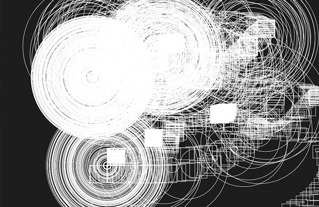

# Complexity-and-Emergence
A written documentation / final paper in Foundations in Digital Media (work in progress, unfinished)

#### Introduction. Statement of the research question.

Can patterns become a mediator and a field of communication between human and machine? Could pattern also mean a form of emergence when looking at the landscape of complex and unknown? Pattern recognition and creation have been on human existence agenda for millennia, in its core lies the idea of abstraction and re-creation. The pattern can also be seen "as an algorithmic movement in making of things" (McLean, 2020), especially when we look at the process of weaving. Pattern travels across various domains of materials and media, such as paper, textiles, clay, pixel space and binary systems. Because of its inherent properties and characteristics, the pattern exists in both fields of human creative thinking and algorithmic computation. I propose to create a language of patterns that can serve as communication protocols merging our thinking and computation on a terrain of equals in response and exchange.  
Keywords: *Patterns, complexity, emergence, human-machine collaboration.*

#### How do we encounter and deal with complexity?

#### #1 The analogy of a puzzle.

 
Figure 1

Imagine sitting by the table with one thousand puzzle pieces laid out in front of you. Where do you start? What strategy, better or worse, will you apply? Just pick a random piece, any piece. As you are twirling this puzzle element in your fingers in an attempt to find some point of reference, you also begin to feel a brewing neural storm up in your brain chambers. Your senses are narrowing down on this one piece of the puzzle, and you start to notice all kinds of things about it: shape, fuzzy but definite colour, some abstract ripped off paint stroke of a larger image yet to be discovered. This singular tiny piece is dense with information, fragmented and ready to be put in use, offering multitudes of obscure, and yet significant clues. Finally, another piece finds it's corresponding match, followed by a few more affirming their neighbouring positions. There is still nine hundred ninety-six more to go, but you are already feeling like a champ. But have you noticed something?
The significance of the singular piece of the puzzle is starting to melt into multitudes. The starting reference point now grows into a field, and soon enough, you are staring at the sunset on some imaginary island. The final piece of the puzzle also rings the death of all puzzle pieces as they get stripped off significance, heightened attention and excessive handling. Hold that thought for a moment about you forgetting that first piece of a puzzle.  

#### #2 Dalmatian.

Figure 2

You are staring at this image, and as the title suggests, you are scanning for this dog. It suddenly magically lifts off the plot of black and white blobs. As a piece of a puzzle, this canine is emerging whilst detaching itself from the field of the noise.

#### #3 Untitled.

Figure 3

What do you see?

#### #4 Let's go back to the thought about the puzzle piece.

Figure 4

Look around, does the world look familiar to you today? Imagine this: the world around you is a finished puzzle. All the pieces are working together tirelessly to render a reality you wake up to every morning. Go and take a closer look, actually, why don't you pick a one piece of a puzzle in your own hands. As a side note, by doing that, you have irreversibly erased all the memory about everything, including the world itself. All that you got is this one piece of a puzzle against the gigantic unknown. How does this piece look to you? What can you tell about it? What strategy, a better or worst, will you apply to learn about this complex new world that you are about to discover?   

#### #5 Patterns.

The pattern is a piece of a mystery, or even a puzzle itself. It has many properties and characteristics. It is also an abstraction of something else, an idea, a concept, or a thing. Its crude visual body is information encoded. A pattern can become a symbol; it is a container, a library. The pattern is a letter in a word, a word in a sentence, and a sentence in a tome of other patterns.

First of all, let us examine the pattern. We look at flat representations of patterns in 2D; we only see two of many possible dimensions. Let's try and think about it as a slice of a state, a frozen moment captured in time passage. Or as a cross-section of a far more exciting and outlandish fruit or vegetable that you will ever encounter!

Figures 5, 6

I am opening this suggestion for a few reasons. Thinking about patterns as an ongoing morphing visualisation will allow me to contextualise the use of the pattern as a live real-time interchange and continuously updated piece of information. Similarly, as in Roy Ascott's 'Change paintings', the spectator can deliberately alter the physical body of painting by sliding Plexiglas layers that reorder and change the composition anew. He calls these kinetic pieces "analogues of ideas" that have an inert property to change and be changed. Roy Ascott believed that ideas should not be fixed and "open to investigation and reconstruction" (Ascott, 1964). To witness a change, we can do it through a feedback loop system. This system allows for a constant update that takes the input and generates the output that gets fed back into the input, becoming a perfect way to detect and observe any change. This change is also evaluated continuously against the previous generation of data and registers occurring and prior chain of events in an ongoing conversation. To me, this looks like a perfect way to create a cross-communication between human and machine, using feedback loops as patterns.

This paper approaches the idea and is a proposal that still needs to be developed through practice. The methodology I would like to start with is as follows:

1) Create an open code environment that allows real-time updates from human and non-human parties. The code will generate a pattern, but also permit its modification and update in real-time from external sources, such as midi or OSC data, as well as internally by using a built-in interpreter in the code environment.

2) Construct meaningful visual registering displays that show input data and updated data simultaneously, perhaps using different colour codes or displayed in 3D as a time slice. See mock-up images below.

3) Allow to capture and record the ongoing pattern modifications that could be studied later away from the code and interaction.

What am I hoping to find?

I hope that this kind of work would bring some insights about modes of working. I don't expect a heartfelt conversation between human and machine; however, I hope to observe fluctuations and coincidences and some form of emergence in pattern generation, a perhaps different type of language to memorise and use for interaction. John H. Holland, an American scientist and professor in computer science and psychology, in his book on emergence talks about mechanisms or "building blocks" that allow to "construct models that exhibit emergent phenomena" (Holland, 1998). I believe there is a way to create a different kind of dialogue outside spoken word and rooted in the space of visualisation and experimentation. The main question persists: when does complexity become emergent? When does emergence appears, has it always been there and we somehow missed it? Is it a Dalmation? Or is it an ability to overwrite complexity with familiarity, which is when emergence has a chance to surface? I used the analogy about the world being a finished puzzle, where we seem to fail in seeing the building blocks. I think this phenomenon addresses the way we look and not see, forgetting about the complexity and emergent phenomena surrounding us everywhere. I hope that patterns would be more suited and complex enough to capture small wonders and situations that are out of ordinary; the ones we might call memorable and emergent.

#### #6 Build your own.

Patterns don't create themselves; people do. Below is a simple puzzle game that invites you to interact with pieces of segments and arrange them to complete the pattern. As the primary inspiration and starting seed, I used traditional Latvian folkloric patterns found woven into textiles and wearable clothing articles such as skirt and belts. I intend to continue work towards creating coded systems that can make and respond to pattern forms. This and examples above serve as my thinking guidelines.

  <pre data-lang="scss" data-option-autoprefixer="true">body {
  text-align: center;
}

.puzzle {
  display: inline-block;
  margin-top: 10px;
}</pre>
  <pre data-lang="js">//this codepen was forked from James Meyers
//https://codepen.io/FullR/pen/zKVKwE

const src = "https://ilzebriede.github.io/Complexity-and-Emergence/images/Artboard.jpg?quality=89&w=500";

class Puzzle {
  constructor({src, rows, columns, width, height}) {
    this.src = src;
    this.rows = rows;
    this.columns = columns;
    this.width = width;
    this.height = height;
    this.tileWidth = width / columns;
    this.tileHeight = height / rows;
    this.tiles = Array.from({length: rows * columns}).map((_, i) => {
      const x = i % columns;
      const y = Math.floor(i / columns);
      return {
        x, y,
        imageX: x,
        imageY: y,
        empty: false
      };
    });
    this.emptyTile = last(this.tiles);
    this.emptyTile.empty = true;
    this.scramble();
    this.createElements();
  }
  
  slideTile(tile) {
    const {emptyTile} = this;
    if(!this.areTilesNeighbors(tile, emptyTile)) return;
    this.swapTiles(tile, emptyTile);
    this.updateTileElPosition(tile);
    this.updateTileElPosition(emptyTile);
  }
  
  swapTiles(a, b) {
    const {x: ax, y: ay} = a;
    const {x: bx, y: by} = b;
    a.x = bx;
    a.y = by;
    b.x = ax;
    b.y = ay;
  }
  
  scramble() {
    const {emptyTile} = this;
    let last = null;
    const isValidTile = (tile) => tile !== last && tile !== emptyTile && this.areTilesNeighbors(tile, emptyTile);
    
    for(let i = 0; i &lt; 1000; i++) {
      const nextTile = last = sample(this.tiles.filter(isValidTile));
      this.swapTiles(emptyTile, nextTile);
    }
  }
  
  updateTileElPosition(tile) {
    const {tileWidth, tileHeight} = this;
    const {el, x, y} = tile;
    el.style.left = `${x * tileWidth}px`;
    el.style.top = `${y * tileHeight}px`;
  }
  
  areTilesNeighbors(a, b) {
    const {x: ax, y: ay} = a;
    const {x: bx, y: by} = b;
    return (
      (a !== b) &&
      (
        (ax === bx && (ay === by + 1 || ay === by - 1)) ||
        (ay === by && (ax === bx + 1 || ax === bx - 1))
      )
    );
  }
  
  createElements() {
    const {src, tiles, width, height, tileWidth, tileHeight} = this;
    const tileEls = tiles.map((tile) => {
      const {x, y, imageX, imageY, empty} = tile;
      const tileEl = createEl("div", "tile");

      Object.assign(tileEl.style, {
        "position": "absolute",
        "width": `${tileWidth}px`,
        "height": `${tileHeight}px`,
        "background-image": `url(${src})`,
        "background-size": `${width}px ${height}px`,
        "background-position": `-${imageX * tileWidth}px -${imageY * tileHeight}px`,
        "transition": "top 0.1s, left 0.1s",
        "vertical-align": "top",
        "cursor": "pointer"
      });
      if(empty) {
        tileEl.style.opacity = "0";
        tileEl.style.cursor = "default";
      }
      
      tileEl.addEventListener("click", this.slideTile.bind(this, tile));
      tile.el = tileEl;
      this.updateTileElPosition(tile);
      return tileEl;
    });

    const puzzleEl = this.el = createEl("div", "puzzle");
    
    Object.assign(puzzleEl.style, {
      position: "relative",
      width: `${width}px`, 
      height: `${height}px`
    });
    
    tileEls.forEach((el) => puzzleEl.appendChild(el));
  }
}

function createEl(tag, ...classNames) {
  const el = document.createElement(tag);
  if(classNames.length) el.classList.add(...classNames);
  return el;
}

function sample(arr) {
  return arr[Math.floor(Math.random() * arr.length)];
}

function last(arr) {
  return arr[arr.length - 1];
}

const puzzle = new Puzzle({
  src,
  width: 600,
  height: 400,
  rows: 4,
  columns: 3
});

document.body.appendChild(puzzle.el);
</pre>

Figure 9

---------

#### List of images.
*  Figure 1. Fragment of a pattern, Ilze Briede 2020
*  Figure 2. Hidden dalmation, Published by James Dean <https://www.moillusions.com/hidden-dalmation-dog/>
*  Figure 3. "File:Cerebellum Cross Section Purkinje Cells (42040995732).jpg" by Berkshire Community College Bioscience Image Library <https://commons.wikimedia.org/w/index.php?curid=70159812>
*  Figure 4. Fragment of a pattern, Ilze Briede 2020
*  Figure 5. Exotic fruits, Jannes Pockele 2009. <https://www.flickr.com/photos/44148352@N00/4200905730>
*  Figure 6. Fragment of a pattern, Ilze Briede 2020
*  Figure 7, 8. Coded patterns created with p5.js, Ilze Briede 2020
*  Figure 9. A codepen puzzle. Image: Ilze Briede 2020, code: James Meyers 2016 <https://codepen.io/FullR/pen/zKVKwE>

#### Annotated bibliography
Ascott, Roy. "The construction of change." Cambridge Opinion 41.1964 (1964): 37-42.

Holland, John H. Emergence: From chaos to order. OUP Oxford, 2000.

McLean, Alex. "Algorithmic Pattern."
