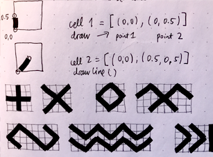

# Complexity-and-Emergence
A written documentation / final paper in Foundations in Digital Media

#1 The analogy of a puzzle.

Imagine sitting by the table with one thousand puzzle pieces laid out in front of you. Where do you start? What strategy, better or worse, will you apply? Just pick a random piece, any piece. As you are twirling this puzzle element in your fingers in an attempt to find some point of reference, you also begin to feel a brewing neural storm up in your brain chambers. Your senses are narrowing down on this one piece of the puzzle, and you start to notice all kinds of things about it: shape, fuzzy but definite colour, some abstract ripped off paint stroke of a larger image yet to be discovered. This singular tiny piece is dense with information, fragmented and ready to be put in use, offering multitudes of obscure, and yet significant clues. Finally, another piece finds it's corresponding match, followed by a few more affirming their neighbouring positions. There is still nine hundred ninety-six more to go, but you are already feeling like a champ. But have you noticed something?
The significance of the singular piece of the puzzle is starting to melt into multitudes. The starting reference point now grows into a field, and soon enough, you are staring at the sunset on some imaginary island. The final piece of the puzzle also rings the death of all puzzle pieces as they get stripped off significance, heightened attention and excessive handling. Hold that thought for a moment about you forgetting that first piece of a puzzle.  

- - -

#2 Dalmatian

You are staring at this image, and as the title suggests, you are scanning for this dog. It suddenly magically lifts off the plot of black and white blobs. As a piece of a puzzle, this canine is emerging whilst detaching itself from the field of the noise.

- - -

#3 Untitled

What do you see?

- - -

#4 Let's go back to the thought about the puzzle piece.

Look around, does the world look familiar to you today? Imagine this: the world around you is a finished puzzle. All the pieces are working together tirelessly to render a reality you wake up to every morning. Go and take a closer look, actually, why don't you pick a one piece of a puzzle in your own hands. As a side note, by doing that, you have irreversibly erased all the memory about everything, including the world itself. All that you got is this one piece of a puzzle against the gigantic unknown. How does this piece look to you? What can you tell about it? What strategy, a better or worst, will you apply to learn about this complex new world that you are about to discover?   

- - - 

#5 Patterns.

The pattern is a piece of a mystery, or even a puzzle itself. It has many properties and characteristics. It is also an abstraction of something else, an idea, a concept, or a thing. Its crude visual body is information encoded. A pattern can become a symbol; it is a container, a library. The pattern is a letter in a word, a word in a sentence, and a sentence in a tome of other patterns.

We look at flat images of patterns in 2D; we only see two of many possible dimensions. It is a slice of a state, a frozen moment captured in passing time, a cross-section of a far more exciting outlandish fruit or vegetable you will ever see!

When does complexity become emergent? When does emergence appears, has it always been there and we somehow missed it? Is it a Dalmation? Or is it an ability to overwrite complexity with familiarity, which is when emergence start to manifest?

